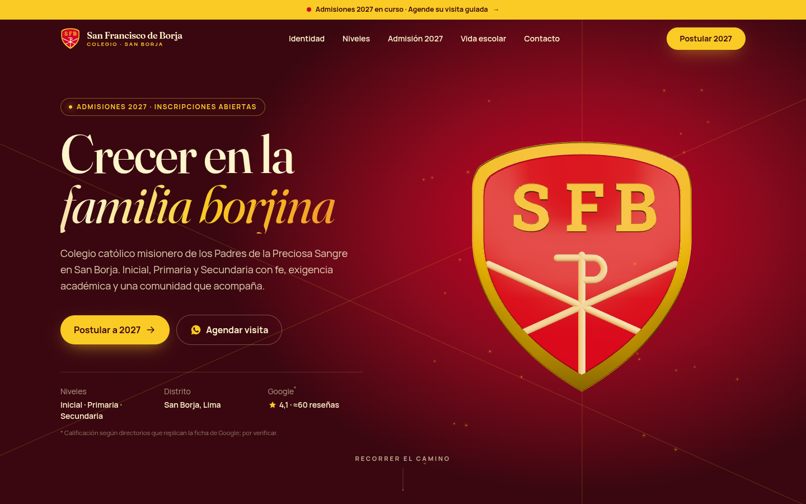
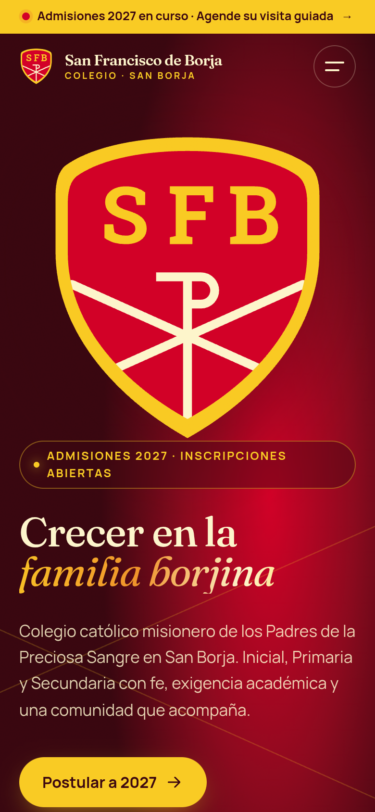

# Colegio San Francisco de Borja — Demo de rediseño web (Admisiones 2027)

> ⚠️ **Demo conceptual no oficial.** Propuesta de diseño elaborada por INKRAAD para presentar al
> Colegio San Francisco de Borja. No está afiliada ni aprobada por el colegio. El escudo es propiedad
> del colegio (aquí recreado en vector solo para la propuesta). Las fotos son referenciales con licencia libre.



## La marca
- **Qué es:** colegio privado **católico misionero** de la Congregación de los Misioneros de la Preciosa Sangre (C.PP.S.), con **Inicial (4 y 5 años), Primaria y Secundaria**.
- **Dónde:** Calle Velásquez cdra. 3 s/n, **San Borja**, Lima. Tel. (01) 476-5393 · Admisión +51 939 509 903 · informes@csfb.edu.pe / admision@csfb.edu.pe.
- **Presencia actual (06-oct-2026):** la web oficial `csfb.edu.pe` **no responde** (timeout desde varias rutas) en plena campaña **Admisiones 2027**, mientras Google y los directorios siguen enviando familias a ese dominio. La comunicación vive en Facebook (≈5.300 seguidores: aniversario 59, nueva biblioteca, festival *El mundo baila*) e Instagram (≈1.600).
- **Identidad:** escudo rojo con borde dorado, iniciales **SFB** y **crismón (☧)**. Paleta oficial extraída del logo: `#D30128` `#F9CB24` `#FDF5CC` `#C20F1B` `#EF922B`.

## Qué se construyó
**Concepto — “Un mismo escudo, de los 4 a los 16 años”.** Al cargar, las piezas reales del escudo (campo rojo, borde dorado, letras SFB y los trazos del crismón) llegan desde el espacio y se **ensamblan en 3D**, igual que la vida escolar va formando a cada estudiante. Las líneas en aspa del crismón se convierten en el hilo gráfico del sitio (fondos del hero, línea de tiempo de admisión, progreso del recorrido) y el color madura con la historia: crema (Inicial) → oro (Primaria) → rojo (Secundaria) → vino (promoción).

### Secciones
1. **Loader de marca:** el contorno del escudo se traza en oro mientras cuenta “59 años de familia borjina”.
2. **Hero:** escudo 3D (React Three Fiber) con materiales oro metálico / esmalte rojo / crema, destello al cerrarse, brillo de partículas doradas, sigue al puntero y gira con el scroll. Título con revelado por palabras y CTA a Admisión 2027 / WhatsApp. Cinta superior “Admisiones 2027 en curso”.
3. **Cinta (marquee)** de valores cuya velocidad responde a la velocidad del scroll.
4. **Identidad:** manifiesto cuyas palabras se “encienden” con el scroll + **“Lea nuestro escudo”** interactivo (puntos sobre SFB, crismón y colores).
5. **Cifras animadas:** 59 años, ≈840 estudiantes, 3 niveles, Sineace 2015 (con fuentes).
6. **El camino borjino (scroll storytelling):** sección fijada con desplazamiento horizontal Inicial → Primaria → Secundaria → Promoción, con contador de **edad (4 → 16 años)**, ficha de cada nivel, pensión referencial, parallax de fotos y snap por capítulo. En móvil se convierte en capítulos verticales con revelados.
7. **Admisiones 2027:** “2027” gigante con degradado animado, **línea de tiempo** de 4 pasos que se dibuja con el scroll, pensiones referenciales, documentos, FAQ en acordeón y **formulario front-end** con validación accesible, estado de éxito y continuación por WhatsApp con mensaje prellenado.
8. **Vida escolar:** galería editorial con revelado por máscara, parallax y **lightbox** con teclado (El mundo baila, nueva biblioteca, coliseo, deporte, fe, promoción).
9. **Convivencia escolar:** pilares de prevención/acompañamiento/canales (responde a la principal crítica en reseñas).
10. **Reseñas de Google:** 4,1 ★ (≈60 reseñas) con estrellas parciales y citas cuidadosamente etiquetadas.
11. **Ubicación y contacto:** datos reales + mapa OpenStreetMap con marcador y botón “Cómo llegar”.
12. **CTA final** con escudo que rota con el scroll y anillos dorados; **footer** con redes y aviso de demo.
13. **WhatsApp flotante** magnético (escritorio) y **barra inferior “Postular / WhatsApp”** (móvil).

### Efectos y detalles
R3F + drei (Environment con Lightformers, sin HDR externos; Sparkles) · ensamblaje por piezas con easing *back/expo* · GSAP ScrollTrigger (pin horizontal con `containerAnimation`, scrub, snap, contadores) · Lenis smooth scroll sincronizado con el ticker de GSAP · Motion (menú móvil con máscara circular, acordeón, lightbox, éxito del formulario) · cursor personalizado (punto rojo + anillo dorado) · botones magnéticos · grano sutil · textos con brillo dorado.

**Rendimiento y accesibilidad:** el 3D se carga en diferido (chunk aparte) solo en pantallas ≥ 900 px con WebGL; en móvil, tablet o sin WebGL se usa un **escudo SVG que se ensambla** (ligero). Con `prefers-reduced-motion` se desactivan Lenis, el 3D y las animaciones. Render 3D pausado fuera de pantalla. Enlace “Saltar al contenido”, foco visible dorado, navegación por teclado (menú, acordeón, lightbox con ←/→/Esc), `alt` en todas las fotos, contraste AA (rojo sobre blanco ≈ 5,5:1; oro solo en texto grande o sobre vino).

**SEO:** `lang="es-PE"`, título y descripción, Open Graph + Twitter card (`public/og-image.jpg`), **schema.org `EducationalOrganization` / `School`** con dirección, geo, horario, contacto de admisión y redes (`index.html`). `noindex` por ser demo.

### Identidad de marca
- `docs/marca/escudo-csfb.svg`: **recreación vectorial fiel** del escudo (superpuesta 1:1 sobre el original; letras SFB trazadas con Roboto Slab Bold a curvas). Original junto a él: `docs/marca/logo-facebook.jpg`.
- `docs/marca/manual-de-marca.md`: manual de marca de trabajo (logo, paleta con HEX, tipografías Fraunces + Manrope, tono, iconografía, usos correctos).
- `src/data/crest.ts`: geometría del escudo (para SVG y para la extrusión 3D).

## Datos reales vs. de ejemplo
| Dato | Estado |
|---|---|
| Nombre, congregación, niveles, dirección, teléfonos, correos, redes, coordenadas | **Real** (brand.md: ficha de Google, MINEDU/ESCALE, fanpage) |
| 59 años (aniversario 30-sep-2026) | **Real** (fanpage). “Desde 1967” es **cálculo**, marcado con * |
| Acreditación Sineace 2015 (primer colegio privado) | **Reportado** por fuentes públicas; vigencia **por confirmar** (nota visible) |
| ≈840 estudiantes | **Referencial** (MINEDU/ESCALE vía terceros) |
| Pensiones S/ 1,300 / 1,400 / 1,500 | **Referenciales** (MINEDU/Identicole vía terceros), montos 2027 por confirmar |
| Rating 4,1 ★ y ≈60 reseñas | **Por verificar** (directorios que replican Google) |
| Cita “bien amplio y ordenado” | Fragmento real citado por tucolegioperu.info; la segunda tarjeta es **paráfrasis** y así se indica |
| Horario Lun–Vie 7:00–16:00 | Ficha de Google; otra fuente dice 17:00 (nota visible) |
| Biblioteca nueva, coliseo, festival *El mundo baila* | **Real** (publicaciones de la fanpage); fotos **referenciales** |
| Pasos y fechas del proceso de admisión, documentos, respuestas FAQ, pilares de convivencia, énfasis pedagógicos por nivel, lectura simbólica de los colores | **Contenido de EJEMPLO** (etiquetado “Ejemplo” en la página y comentado en `src/data/site.ts`) |
| Formulario | Solo front-end: valida y muestra éxito, **no envía datos** |
| Dominio canónico `csfb.edu.pe` en metadatos | Supuesto para la propuesta |

## Tecnologías
Vite 8 · React 19 · TypeScript · Tailwind CSS v4 · Three.js 0.182 + @react-three/fiber + @react-three/drei · GSAP + ScrollTrigger · Lenis · Motion · Fontsource (Fraunces, Manrope) · Playwright (capturas y QA).

## Cómo correrlo
```bash
npm install
npm run dev        # http://localhost:3127
npm run build      # build estático en dist/
npm run preview    # sirve dist/ en http://localhost:3127
node scripts/screenshots.mjs all   # capturas (requiere preview corriendo y Chrome en /usr/bin/google-chrome)
node scripts/qa.mjs                # QA: navegación, formulario, lightbox, menú móvil
```

## Capturas
| Escritorio (hero) | Móvil (hero) |
|---|---|
|  |  |

- Página completa escritorio: [`screenshots/desktop-1440-full.jpg`](screenshots/desktop-1440-full.jpg)
- Página completa móvil: [`screenshots/mobile-390-full.jpg`](screenshots/mobile-390-full.jpg)
- Loader: `screenshots/desktop-1440-preloader.png`, `screenshots/mobile-390-preloader.png` · Tablet: `screenshots/tablet-768-hero.png` · Movimiento reducido: `screenshots/desktop-reduced-motion-hero.png`
- Consola durante las capturas: `screenshots/console-errors.txt` (sin errores ni advertencias)

## Créditos de imágenes (todas referenciales, descargadas al repo en `public/img/`)
Licencia de Pexels y Licencia de Unsplash (uso libre, sin atribución obligatoria; se acredita igualmente).
- `inicial` — *Kids Doing Artwork* — Ksenia Chernaya (Pexels) — https://www.pexels.com/photo/kids-doing-artwork-8535599/
- `primaria` — *Children Raising Their Hands* — Yan Krukau (Pexels) — https://www.pexels.com/photo/children-raising-their-hands-8617938/
- `biblioteca` — *Students Reading Books in the Library* (Pexels) — https://www.pexels.com/photo/students-reading-books-in-the-library-9572509/
- `lectura` — *Boy in School Uniform Reading a Book* (Pexels) — https://www.pexels.com/photo/boy-in-school-uniform-reading-a-book-8500410/
- `secundaria` — *Students Writing in a Sunlit Classroom in Buenos Aires* (Pexels) — https://www.pexels.com/photo/students-writing-in-a-sunlit-classroom-in-buenos-aires-37758766/
- `convivencia` — *Girls in School Uniforms Choosing Books in Classroom* (Pexels) — https://www.pexels.com/photo/girls-in-school-uniforms-choosing-books-in-classroom-10638225/
- `danza` — *People Dancing in Traditional Clothing on Festival* (Lucre, Cusco) — JANOX (Pexels) — https://www.pexels.com/photo/people-dancing-in-traditional-clothing-on-festival-16756546/
- `fe` — *Votive Candles and Cross in Church Setting* (Pexels) — https://www.pexels.com/photo/votive-candles-and-cross-in-church-setting-30926399/
- `promocion` — *People Wearing Graduation Gowns Tossing their Graduation Caps in the Air* (Pexels) — https://www.pexels.com/photo/people-wearing-graduation-gowns-tossing-their-graduation-caps-in-the-air-7713548/
- `ciencia` — *Teacher and student conducting science experiment in classroom* (Unsplash) — https://unsplash.com/photos/UStQpco0TWo
- `coliseo` — *An indoor basketball court with a basketball hoop* — Kinanti Pratiwi (Unsplash) — https://unsplash.com/photos/8IU-NfPbVR4
- `deporte` — *Group of girls playing basketball inside court* (Unsplash) — https://images.unsplash.com/photo-1548546727-1f59cf65ad19

Para producción: reemplazar por fotos reales del colegio (álbumes de su fanpage: aniversario 59, biblioteca, *El mundo baila*, coliseo) con su autorización.

Tipografías: Fraunces y Manrope (SIL Open Font License). Escudo: propiedad del Colegio San Francisco de Borja.
